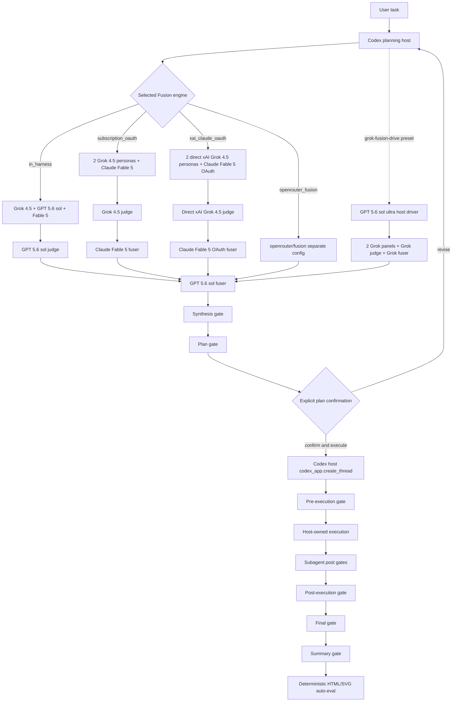

# Fusion Drive architecture

## Trust boundary

The MCP server owns configuration, external model calls, persisted artifacts,
gate receipts, lifecycle validation, and reports. The Codex host owns user
interaction, project selection and thread creation, native subagent/model selection, filesystem tools,
and execution.

This split is deliberate. An MCP process cannot truthfully prove a user clicked
or typed a confirmation and cannot invoke host-only goal state. It records
content-addressed host receipts and rejects illegal transitions.

## Configuration boundary

Schema-v2 keeps five independent engine objects:

- `engines.in_harness`
- `engines.subscription_oauth`
- `engines.xai_claude_oauth`
- `engines.openrouter_fusion`
- `engines.all_grok_4_5`

`profiles.subscription-oauth` selects only OAuth CLI seats and its serialized
two-reviewer OAuth gate set. The global `maximum-intelligence` default remains
the canonical API-backed profile, with no silent fallback between profiles.

`profiles.xai-claude-oauth` selects direct xAI Grok panel/judge/gate seats and
Claude OAuth panel/fuser seats. Its gate reviewers are serialized, its xAI cost
is metered, its Claude subscription use remains unknown, and it does not route
through OpenRouter.

Seat-level OpenRouter server settings use `openrouter_fusion`, avoiding the
upstream ambiguity where profile engine selection and seat plugin parameters
both used the key `fusion`.

## Persistence

- Inherited engine runs: `~/.codex/codex-fusion-drive/engine/runs`
- Durable asynchronous jobs: `~/.codex/codex-fusion-drive/jobs`
- Host lifecycle: `~/.codex/codex-fusion-drive/workflows`
- Configuration proposals: `~/.codex/codex-fusion-drive/proposals`
- Provider batch bundles: `~/.codex/codex-fusion-drive/batches`
- Rescue packets: `~/.codex/codex-fusion-drive/rescue`
- Human-sim campaigns: `~/.codex/codex-fusion-drive/human-sim-users`
- Auto-eval reports: `~/.codex/codex-fusion-drive/reports`

Lifecycle and campaign mutations are atomic and compare-and-swap protected.
Lifecycle events additionally form a SHA-256 chain.

Job manifests bind an idempotency key to exact request and configuration hashes.
Workers persist their state and a hash of any completed result. Orphaned workers
are marked failed without redispatch. Abort requests write the inherited
recoverable `KILL` switch and never force-kill a potentially billable provider
call.
